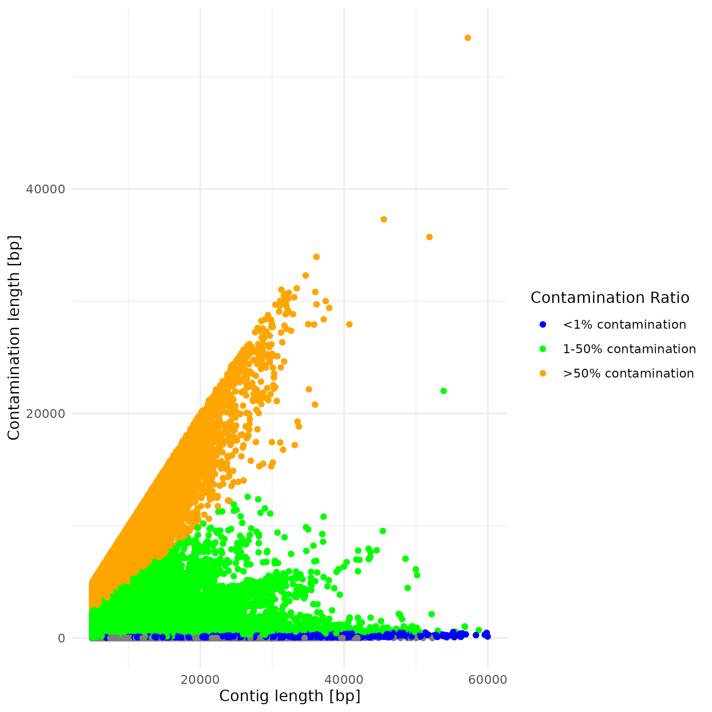
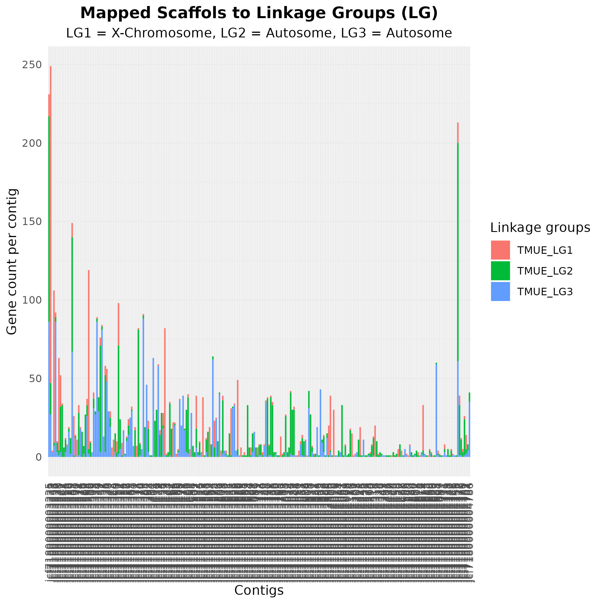
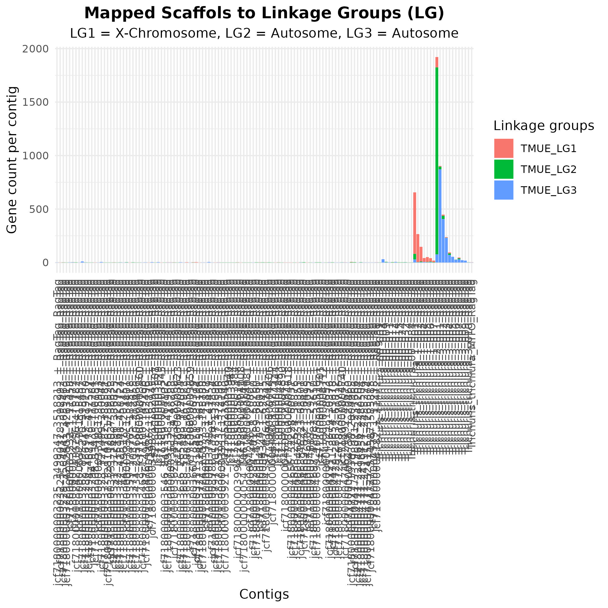

# De-novo hybrid assembly pipeline

Author: Max Bär, max.baer[at]swisstph.ch

## Contents:

This section presents the code used for the de-novo hybrid assembly of *T. resilentia*. It is presented by the individual
nextflow processes which are combined in a final workflow. This script was run on the SciCORE computing cluster at the University
of Basel with most modules pre-installed. Many scripts were adapted from Stephen Doyle's project on ancient and modern *Trichuris* 
genomes. [Population genomics of ancient and modern Trichuris trichiura](https://github.com/stephenrdoyle/ancient_trichuris/tree/master)

Table of contents

1. [Raw read processing](#raw_reads)
   1. [Nextflow settings](#settings)
   2. [Clipping nanopore long reads with chopper](#clipping)
   3. [Cleaning nanopore long reads with Kraken2 and a custom python script](#cleaning1)
   4. [Filtering of Illumina reads using Kraken2](#cleaning2)
2. [Assembly](#assembly)
   1. [Running MaSuRCA hybrid de-novo assembly](#masurca)
   2. [Assessing the quality of the genome through the *T. muris* genome using liftoff](#process1)
   3. [Correcting and re-scaffolding using RagTag and a reference genome from *T. trichiura*](#process2)
   4. [Re-run linkage group assignment and visualisation](#process3)
3. [Quality assessment](#QA1)
4. [Nextflow workflow](#NF1)

___
## Raw read processing 
Nanopore reads had to be adaptor trimmed, whereas Illumina short reads were received as trimmed reads.
### Nextflow environment variables 
DSL 2 option was used with nextflow and directories of reads and reference genomes were defined outside of processes.

    nextflow.enable.dsl=2

    params.illumina_reads = "*/illumina_reads/GFB-7577_HWNGYDSX5_3_TRICHURIS777Tiagba_S147_L003_R{1,2}_001.fastq.gz"
    params.nanopore_reads_dir = "*/ONT/de_novo_pipeline/fastq_files/duplex_called_reads/"
    params.reference_whole_genome_doyle = "*/reference/trichuris_trichiura.fa"

### Clipping nanopore long reads with chopper - process chopper 
Chopper version 0.6.0 was used for ONT raw read processing. The cutoff was chosen based on literature reported optimal 
read lengths of above 5000. Max length was chosen based on poor quality after 60'000 basepairs.

    process chopper {

        output:
    
        path("nanopore_reads.fastq")
    
        script:
    
        """
    
        ml load Python/3.9.5-GCCcore-10.3.0
    
        cat ${params.nanopore_reads_dir}barcode* | /*/packages/chopper-0.6.0/target/release/chopper -l 5000 -q 10 --headcrop 34 --maxlength 60000 --threads 8 > nanopore_reads.fastq
        """
    }

### Cleaning nanopore long reads with Kraken2 and a custom python script - process kraken2_nanopore 
Kraken2, version 2.1.1 was used to identify contaminated sections in Nanopore long reads. The ration of contamination of 
each contig was then identified and contigs above 50% contamination were filtered out using custom python, bash and R-scripts.

    process kraken2_nanopore {

        input:
        path(nanopore_reads)
    
        output: 
        path("clean_nanopore_reads.fastq")
    
        script:
        """
        ml load Kraken2/2.1.1-foss-2018b-Perl-5.28.0;
        kraken2 \
        --db /*/kraken_191029/ \
        --threads 16 \
        --report nanopore_kraken2report \
        --classified-out nanopore_reads_c.fastq \
        --unclassified-out nanopore_reads_uc.fastq \
        --output kraken_out \
        ${nanopore_reads} ;
    
        ml purge;
        ml load Python/3.9.5-GCCcore-10.3.0;
        python /*/ratio_of_contaminant_from_kraken.py kraken_out > contamination_ratio.txt ;
    
    
        ml purge
        ml load R/4.3.0-foss-2021a
        Rscript /*/contamination_ratio_commandline.R "contamination_ratio.txt" ;
    
        awk 'NR==FNR { headers[\$0]; next } FNR%4 == 1 { header = \$0 } header in headers { next } 1' filtered_data.tsv ${nanopore_reads} > clean_nanopore_reads.fastq
        """
    }

Python script to determine contamination ratio:

    import sys
    
    # read the result of kraken
    contaminant_ratio = {}

    with open(sys.argv[1], 'r') as fin:
        for line in fin:
            line = line.strip().split('\t')
            code, seqID, taxon, seq_len, classifies = line[:5]
            contaminant_ratio[seqID] = [int(seq_len)]
            if code == "U":
                contaminant_ratio[seqID].append(0)
                contaminant_ratio[seqID].append(0)
            else:
                tmp_list = []
                gross_kmer_num = 0
                for classify in classifies.split(' '):
                    # get all corrdinates (1-based) of contaminants
                    taxon, current_kmer_num = classify.split(':')
                    current_kmer_num = int(current_kmer_num)
                    if taxon == "0":
                        pass
                    else:
                        left = gross_kmer_num + 1
                        right = gross_kmer_num + current_kmer_num + 30
                        tmp_tuple = (left, right)
                        tmp_list.append(tmp_tuple)
                    gross_kmer_num += current_kmer_num
                # merge overlapped regions
                if len(tmp_list) == 0:
                    total_con_len = 0
                elif len(tmp_list) == 1:
                    total_con_len = tmp_list[0][1] - tmp_list[0][0] + 1
                    contaminant_ratio[seqID].append(total_con_len)
                    contaminant_ratio[seqID].append(float(contaminant_ratio[seqID][1])/contaminant_ratio[seqID][0])
                else:
                    contaminants_loci = []
                    tmp_min, tmp_max = tmp_list[0]
                    i = 1
                    while (i < len(tmp_list)):
                        if tmp_list[i][0] < tmp_max:
                            tmp_max = tmp_list[i][1]
                        else:
                            contaminants_loci.append((tmp_min, tmp_max))
                            tmp_min, tmp_max = tmp_list[i]
                        i += 1
                    else:
                        contaminants_loci.append((tmp_min, tmp_max))
                    total_con_len = 0
                    for x in contaminants_loci:
                        total_con_len += (x[1] -x[0] + 1)
                    contaminant_ratio[seqID].append(total_con_len)
                    contaminant_ratio[seqID].append(float(contaminant_ratio[seqID][1])/contaminant_ratio[seqID][0])
    
    # seqID seqLen contaminantLen ratio
    #print(seqID + '\t' + '\t'.join([str(i) for i in contaminant_ratio[seqID]]))
    for seqID in contaminant_ratio:
        values = contaminant_ratio[seqID]
        line = '\t'.join([str(seqID)] + [str(i) for i in values])
        print(line)

Custom R-script to visualize contamination ratios and filter them out:

    library(tidyverse)
    
    # Retrieve the command line arguments
    args <- commandArgs(trailingOnly = TRUE)
    
    # Check if an argument is provided
    if (length(args) == 0) {
      stop("Please provide the path to the input file as a command line argument.")
    }
    
    # Read the input file
    input_file <- args[1]
    df <- read.delim(input_file, header = FALSE)
    
    # Create the ggplot and save the plot
    ggplot(df, aes(x = V2, y = V3, color = cut(V4, breaks = c(0, 0.01, 0.5, Inf), labels = c("<1% contamination", "1-50% contamination", ">50% contamination")))) +
      geom_point() +
      scale_color_manual(values = c("<1% contamination" = "blue", "1-50% contamination" = "green", ">50% contamination" = "orange")) +
      labs(x = "Contig length [bp]", y = "Contamination length [bp]", color = "Contamination Ratio") +
      theme_minimal()
    ggsave("Contamination_ratio.jpg")
    
    
    # Filter the data
    filtered_df <- df %>%
      filter(V4 > 0.50)
    
    # Save the filtered_df as a tab-separated file
    output_file <- "filtered_data.tsv"
    #write.table(filtered_df[1], file = output_file, sep = "\t", row.names = FALSE, col.names = FALSE, quote = F)
    
    #write.table(paste("@", filtered_df$V1), file = output_file, sep = "\t", row.names = FALSE, col.names = FALSE, quote = FALSE)
    lines <- paste0("@", filtered_df$V1)
    writeLines(lines, con = output_file)
    # Print the first row of the filtered data
    #print(filtered_df[1])

### Filtering of Illumina reads using Kraken2 - process kraken2_illumina 
Here Illumina reads are filtered using standard Kraken2 options  

    process kraken2_illumina {
        input:
        tuple val(pair_id), path(reads)
    
        output:
        tuple val(pair_id), path("${pair_id}uc_{1,2}.fastq")
    
        script:
        """
        ml load Kraken2/2.1.1-foss-2018b-Perl-5.28.0
        kraken2 \
        --db /*/kraken_191029/ \
        --threads 16 \
        --report ${pair_id}_kraken2report \
        --paired \
        --unclassified-out ${pair_id}uc#.fastq \
        --output kraken_out \
        ${reads[0]} ${reads[1]}
        """
    }
## Assembly 
### Running MaSuRCA hybrid de-novo assembly - process masurca_run 
Illumina and Nanopore channels are joined to provide an input channel for MaSuRCA version 4.0.9

    process masurca_run {
        input:
        tuple val(pair_id), path(illumina_reads)
        path(nanopore_reads)
    
        output:
        path("assembly.fasta")
    
        script:
        """
        ml load MaSuRCA/4.0.9-foss-2021a-Perl-5.32.1;
        masurca -t 32 \
        -i ${illumina_reads[0]},${illumina_reads[1]} \
        -r ${nanopore_reads};
    
        cp CA.mr.99.17.15.0.02/primary.genome.scf.fasta ./assembly.fasta
        """
    }

### Asessing the quality of the genome through the *T. muris* genome using liftoff - process linkage_group_MaSuRCA 
To get a first idea of how contiguous the assembly was, Liftoff was used to assign contigs to linkage groups and identify larger
missassemblies to assess if RagTag had to be used to correct and re-scaffold the assembly. After assessing the linkage group assignments,
RagTag was used to correct and adjust the assembly.

    process linkage_group_MaSuRCA {
    
    
      input:
        path(raw_masurca_assembly)
    
        output:
        path("genome_with_new_headers_sorted.fasta")
    
      script:
        """
        ml load minimap2/2.20-GCCcore-10.3.0;
        ml load Python/3.9.5-GCCcore-10.3.0;
        source $HOME/venv_liftoff/bin/activate;
    
        liftoff -db /*/trichuris_muris.PRJEB126.WBPS17.annotations.gff3_db \
        ${raw_masurca_assembly} /*/trichuris_muris.PRJEB126.WBPS17.genomic.fa \
        -o Masurca_liftoff.gff \
        -u Masurca_unmapped_liftoff;
    
        grep ">" ${raw_masurca_assembly} > raw_masurca_assembly_headers
    
        ml purge;
        ml load R/4.3.0-foss-2021a;
        Rscript /*/Assign_LG_to_scaffolds_clean.R Masurca_liftoff.gff \
        /*/trichuris_muris.PRJEB126.WBPS17.annotations.onlygenes.gff \
        raw_masurca_assembly_headers;
    
        awk -F'\t' 'FNR==NR {f2[\$2]=\$1;next} \$2 in f2 {\$2=f2[\$2]}1' New_Old_names3 FS='>' OFS='>' ${raw_masurca_assembly} > genome_with_new_headers.fasta
    
        ml purge
        conda init bash;
        eval "\$(conda shell.bash hook)";
        conda activate seqkit;
        seqkit sort -nN genome_with_new_headers.fasta -o genome_with_new_headers_sorted.fasta
        """
    
    }

Custom R-script to visualize linkage groups:

    library(tidyverse)
    library(stringr)
    
    args <- commandArgs(trailingOnly = TRUE)
    gff_file1 <- args[1]
    gff_file2 <- args[2]
    contig_names_file <- args[3]
    
    getwd()
    
    #load df and ref df
    df <- read.table(file = gff_file1)
    df_ref <- read.table(file = gff_file2)
    df_contig_names <- read.table(file = contig_names_file, header = FALSE)
    df_contig_names <- rename(df_contig_names, V1.x = V1)
    df_contig_names$V1.x <- substr(df_contig_names[,1], 2, 100)
    df <- df  %>%
      filter(V3 == "gene")
    
    #create new column with gene ID's
    df$V11 <- substr(df[,9], 15, 22)
    df_ref$V11 <- substr(df_ref[,9], 15, 22)
    
    #merge df to get LG
    df_merged <- dplyr::inner_join(df, df_ref, by="V11")
    
    #create image of contig assignment based on genes
    ggplot(df_merged) +
     aes(x = V1.x, fill = V1.y) +
     geom_bar() +
     scale_fill_hue(direction = 1) +
     labs(x = "Contigs", 
     y = "Gene count per contig", title = "Mapped Scaffols to Linkage Groups (LG)", fill = "Linkage groups", subtitle = "LG1 = X-Chromosome, LG2 = Autosome, LG3 = Autosome") +
     theme_minimal() +
     theme(plot.title = element_text(face = "bold", hjust = 0.5), plot.subtitle = element_text(hjust = 0.5)) +
     theme(axis.text.x = element_text(angle = 90, vjust = 0.5, hjust=1))
    
    ggsave("linkage_group_assignment.jpg")
    
    #data cleaning
    df_unique_contig <- as.data.frame(df_merged %>%
      group_by(V1.x) %>%
      count(V1.y) %>%
      mutate(n/sum(n)) %>%
      group_by(V1.x) %>%
      top_n(1,))
    df_unique_contig <- df_unique_contig %>%
      arrange(V1.y, desc(n))
    df_unique_contig <- tibble::rowid_to_column(df_unique_contig, "ID")
    df_unique_contig$New_name <- str_c("TTRE_chr", substr(df_unique_contig[,3], 8,8), "_scaffold", df_unique_contig[,1])
    df_new_contig_names <- dplyr::full_join(df_contig_names, df_unique_contig, by="V1.x")
    df_new_contig_names <- df_new_contig_names %>%
      arrange(ID)
    df_new_contig_names <- df_new_contig_names %>%
      mutate(
        New_name = ifelse(is.na(ID), paste0("TTRE_unplaced_scaffold", seq(nrow(df_unique_contig)+1, nrow(df_unique_contig)+1 + sum(is.na(ID)) - 1)), New_name),
        ID = ifelse(is.na(ID), seq(nrow(df_unique_contig)+1, nrow(df_unique_contig)+1 + sum(is.na(ID)) - 1), ID),
        )
    df_new_contig_names <- df_new_contig_names %>%
      arrange(ID)
    df_final <-df_new_contig_names %>%
      select(6,1)
    names(df_final)<-NULL
    names(df_final[,2])<-NULL
    
    
    write.table(df_final, file = "New_Old_names3", sep = "\t", row.names = F, col.names = F, quote = FALSE)

### Correcting and re-scaffolding using RagTag and a reference genome from *T. trichiura* - process ragtag_correct and ragtag_scaffold 
Assembly was corrected and re-scaffoleded using a reference *T. trichiura* genome

    process ragtag_correct {
        input:
        path(raw_masurca_assembly)
    
        output:
        path("ragtag_corrected.fasta")
        
        script:
        """
        ml load minimap2/2.20-GCCcore-10.3.0;
        ml load Python/3.9.5-GCCcore-10.3.0;
        source $HOME/venv_ragtag/bin/activate;
        ragtag.py correct \
        ${params.reference_whole_genome_doyle} \
        ${raw_masurca_assembly} \
        -o ragtag_corrected;
    
        cp ragtag_corrected/ragtag.correct.fasta ragtag_corrected.fasta
        """
    
    }
    
    process ragtag_scaffold {
        input:
        path(masurca_corrected_assembly)
    
        output:
        path("ragtag_scaffolded2.fasta")
        
        script:
        """
        ml load minimap2/2.20-GCCcore-10.3.0;
        ml load Python/3.9.5-GCCcore-10.3.0;
        source $HOME/venv_ragtag/bin/activate;
        ragtag.py scaffold -u \
        ${params.reference_whole_genome_doyle} \
        ${masurca_corrected_assembly} \
        -o ragtag_scaffolded;
    
        cp ragtag_scaffolded/ragtag.scaffold.fasta ragtag_scaffolded.fasta;
    
        ragtag.py scaffold -u \
        ${params.reference_whole_genome_doyle} \
        ragtag_scaffolded.fasta \
        -o ragtag_scaffolded2;
    
        cp ragtag_scaffolded2/ragtag.scaffold.fasta ragtag_scaffolded2.fasta
        """
    }

### Re-run Linkage group assignment and visualisation - process linkage_group_ragtag 
The assignment to linkage groups was re-run. 

    process linkage_group_ragtag {
    
        input:
        path(masurca_assembly_final)
    
        output:
        path("Trichuris_cote_divoire_freeze.fasta")
    
        script:
        """
        ml load minimap2/2.20-GCCcore-10.3.0;
        ml load Python/3.9.5-GCCcore-10.3.0;
        source $HOME/venv_liftoff/bin/activate;
    
        liftoff -db /*/trichuris_muris.PRJEB126.WBPS17.annotations.gff3_db \
        ${masurca_assembly_final} /*/trichuris_muris.PRJEB126.WBPS17.genomic.fa \
        -o Masurca_liftoff.gff \
        -u Masurca_unmapped_liftoff;
    
        grep ">" ${masurca_assembly_final} > raw_masurca_assembly_headers
    
        ml purge;
        ml load R/4.3.0-foss-2021a;
        Rscript /*/Assign_LG_to_scaffolds_clean.R Masurca_liftoff.gff \
        /*/trichuris_muris.PRJEB126.WBPS17.annotations.onlygenes.gff \
        raw_masurca_assembly_headers;
    
        awk -F'\t' 'FNR==NR {f2[\$2]=\$1;next} \$2 in f2 {\$2=f2[\$2]}1' New_Old_names3 FS='>' OFS='>' ${masurca_assembly_final} > genome_with_new_headers.fasta
    
        ml purge
        conda init bash;
        eval "\$(conda shell.bash hook)";
        conda activate seqkit;
        seqkit sort -nN genome_with_new_headers.fasta -o Trichuris_cote_divoire_freeze.fasta
        """
    }

  
## Quality assessment 
### Assess quality of assembly - process quality_control 
Genome completeness was assessed using BUSCO and genome stats were obtained using QUAST.

    process quality_control {
      input:
        path(final_assembly)
    
        output:
        path("busco_out_1")
    
    
        script:
        """
        ml purge;
        ml load BUSCO/5.1.2-foss-2018b-Python-3.6.6
        busco -i ${final_assembly} \
        -l /*/metazoa_odb10/ \
        -o busco_out \
        -m genome \
        -c 32 \
        --offline;
        cp busco_out/short_summary.specific..busco_out.txt busco_out_1
    
        ml purge;
        ml load QUAST/5.0.2-foss-2018b-Python-3.6.6;
        quast ${final_assembly}
        """
    }

## Combined workflow of the assembly in Nextflow 

    workflow assembly {
        chopper()
        nanopore_reads_ch = chopper.out
    
        kraken2_nanopore(nanopore_reads_ch)
        nanopore_reads_cleaned_ch = kraken2_nanopore.out
    
        illumina_reads_ch = channel.fromFilePairs(params.illumina_reads, checkIfExists: true)
        kraken2_illumina(illumina_reads_ch)
        illumina_reads_cleaned_ch = kraken2_illumina.out
    
        masurca_run(illumina_reads_cleaned_ch, nanopore_reads_cleaned_ch)
        raw_masurca_assembly_ch = masurca_run.out
        
        linkage_group_MaSuRCA(raw_masurca_assembly_ch)
    
        ragtag_correct(masurca_run.out)
        ragtag_corrected_ch = ragtag_correct.out
    
        ragtag_scaffold(ragtag_corrected_ch)
        ragtag_scaffolded_ch = ragtag_scaffold.out
    
        linkage_group_ragtag(ragtag_scaffolded_ch)
        final_genome_ch = linkage_group_ragtag.out
    
        quality_control(final_genome_ch)
    }

