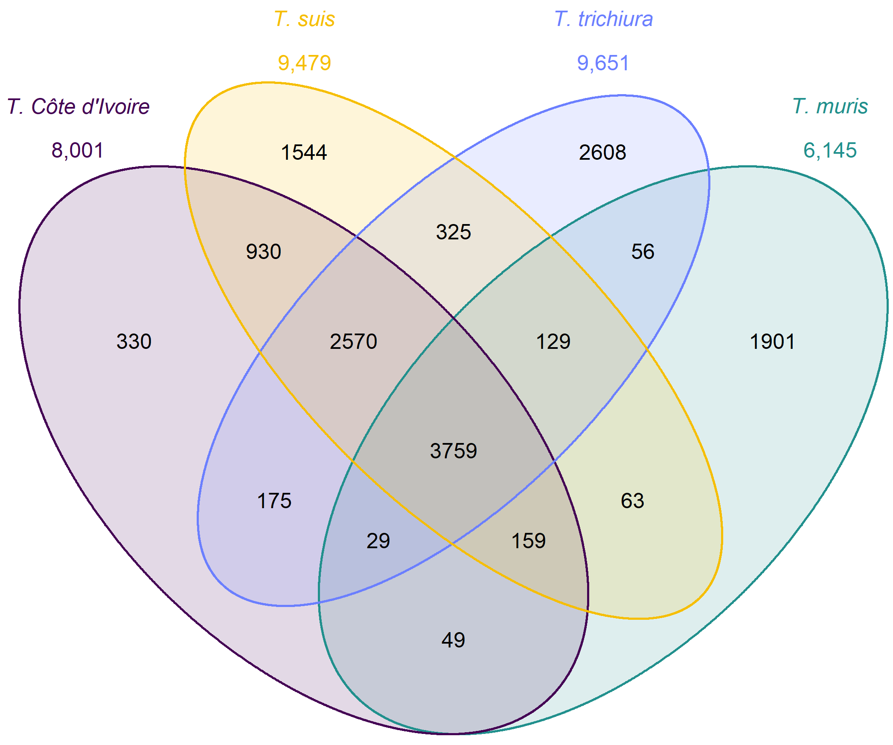

# De-novo annotation pipeline

Author: Max Bär, max.baer[at]swisstph.ch

## Contents:

This section presents the code used for the annotation of the newly assembled *T. resilentia* genome and publicly available whole genomes of *Trichuris* species. It is presented by
the individual nextflow processes which are combined in a final workflow or individual sections for further processing outside
of Nextflow. This script was run on the SciCORE computing cluster at the University of Basel with most modules pre-installed.
Many scripts were adapted from Stephen Doyle's project on ancient and modern *Trichuris* genomes.
[Population genomics of ancient and modern Trichuris trichiura](https://github.com/stephenrdoyle/ancient_trichuris/tree/master)

Table of contents

1. [Gene prediction](#annotation)
   1. [Nextflow settings](#settings)
   2. [Repeat masking](#repeat)
   3. [Breaker2 gene prediction](#pred1)
   4. [Generation of fasta files only containing genes](#pred2)
   5. [Gene prediction statistics](#pred3)
2. [Gene Orthology and functional annotation ](#Orthology)
   1. [Nextflow workflow](#NF1)
   2. [Gene orthology inference using OrthoFinder](#OrthoFinder)
   3. [Gene orthology inference using OMA](#OMA)
   4. [Venn diagram R-script](#Venn)
   5. [InterProScan functional annotation](#InterProScan)
   6. [Custom bash snippet for blasting all sequences in a folder against a blast db](#bash)
   7. [Filter out highly duplicated gene families of *T. resilentia*](#dup)

___
## Annotation and gene prediction 
The braker2 pipeline with the Metazoan database was used for gene prediction of all available reference genomes.

### Nextflow environment variables 
DSL 2 option was used with nextflow and directories of genomes and databases used were defined outside of processes.

    nextflow.enable.dsl=2
      
    params.whole_genome_assembly_freeze = "/*/de_novo_annotation_pipeline/trichuris_suis_PRJNA208416.fasta"
    params.prothint_output = "/*/de_novo_annotation_pipeline/prothint_augustus.gff"
    params.protein_db_metazoa = "/*/de_novo_annotation_pipeline/Metazoa.fa"

### Repeat masking - process repeatmasker 
Repetative regions were masked using RepeatMasker version 4.1.4 as a preparation for Braker

    process repeatmasker {
        input:
        path(genome_assembly)
      
        output:
        path("${genome_assembly}_masked.fasta")
      
        script:
        """
        mkdir run1 ;
        ml load RepeatMasker/4.1.4-foss-2021a ;
        perl  /*/RepeatMasker -species nematoda -pa 8 -xsmall -dir ./run1 ${genome_assembly} ;
        cp run1/${genome_assembly}.masked ./${genome_assembly}_masked.fasta
        """
      }

### Breaker2 gene prediction - process braker2 
Braker2 version 3.0.6 using the Metazoa protein database from OrthoDB 11 was used for gene prediction.

    process braker2 {
      input:
      path(repeat_masked_assembly)
   
      output:
      tuple path("${repeat_masked_assembly}"), path("braker2.gff")
   
      script:
      """
      export TMPDIR=/tmp/;
      singularity exec /*/braker3_latest.sif braker.pl \
      --threads=16 \
      --genome=${repeat_masked_assembly} \
      --prot_seq=${params.protein_db_metazoa} \
      --gff3  --species=trichuris  --useexisting;
      cp braker/braker.gff3 ./braker2.gff
      """
    }

### Generation of fasta files only containing genes - process gffread 
Gff files were filtered for genes and the corresponding fasta files were generated and the headers adjusted for interproscan

    process gffread {
     publishDir "/*/", mode: 'copy'
   
     input:
     tuple path(repeat_masked_assembly), path(gff_file)
   
     output:
     path("${repeat_masked_assembly}gene_sequences.fasta")
   
     script:
     """
     ml load BEDTools/2.30.0-GCC-10.3.0;
     grep "gene" ${gff_file} > genes.gff;
     awk 'BEGIN {OFS="\\t"} \$3 == "gene" {split(\$9, a, ";"); split(a[1], b, "="); \$3 = b[1]"="b[2]; print}' genes.gff > output_file.gff;
     sed -E '/^>/ s/ /_/g' ${repeat_masked_assembly} > ${repeat_masked_assembly}_clean_header.fasta;
     bedtools getfasta -fi ${repeat_masked_assembly}_clean_header.fasta -bed output_file.gff -fo ${repeat_masked_assembly}gene_sequences.fasta -name
     """
    }

### Gene prediction statistics - process stats 
Gene prediction statistics were generated using custom bash snippets for things like Exon count, intron count ect. from the 
corresponding braker2.gff files

    process stats {
     publishDir "/*/stats_genome/", mode: 'copy'
   
     input:
     tuple path(repeat_masked_assembly), path(gff_file)
   
     output:
     tuple path("${repeat_masked_assembly}_report.tsv"), path("${repeat_masked_assembly}_gene_stats.tsv"), path("${repeat_masked_assembly}_busco/short_summary.specific..${repeat_masked_assembly}_busco.txt")
   
     script:
     """
     ml load QUAST/5.0.2-foss-2018b-Python-3.6.6;
     mkdir quast_out;
     quast.py ${repeat_masked_assembly} -o quast_out/;
     cp quast_out/report.tsv ${repeat_masked_assembly}_report.tsv
   
     exon_count=\$(grep -c "exon" ${gff_file});
     mean_exon_length=\$(awk '\$3 == "exon" {print \$5 - \$4 + 1}' ${gff_file} | awk '{ sum += \$1 } END { if (NR > 0) print sum / NR }');
     median_exon_length=\$(awk '\$3 == "exon" {print \$5 - \$4 + 1}' ${gff_file} | sort -n | awk '{ a[i++] = \$1; } END { if (i % 2 == 0) print (a[i / 2 - 1] + a[i / 2]) / 2; else print a[int(i / 2)]; }');
   
     intron_count=\$(grep -c "intron" ${gff_file});
     mean_intron_length=\$(awk '\$3 == "intron" {print \$5 - \$4 + 1}' ${gff_file} | awk '{ sum += \$1 } END { if (NR > 0) print sum / NR }');
     median_intron_length=\$(awk '\$3 == "intron" {print \$5 - \$4 + 1}' ${gff_file} | sort -n | awk '{ a[i++] = \$1; } END { if (i % 2 == 0) print (a[i / 2 - 1] + a[i / 2]) / 2; else print a[int(i / 2)]; }');
   
   
     cds_length=\$(awk '\$3 == "CDS" {sum += \$5 - \$4 + 1} END {print sum}' ${gff_file});
   
     echo -e "Exon_count\\t\$exon_count" >> "output_results.tsv";
     echo -e "Mean_exon_length\\t\$mean_exon_length" >> "output_results.tsv";
     echo -e "Median_exon_length\\t\$median_exon_length" >> "output_results.tsv";
     echo -e "Intron_count\\t\$intron_count" >> "output_results.tsv";
     echo -e "Mean_intron_length\\t\$mean_intron_length" >> "output_results.tsv";
     echo -e "Median_intron_length\\t\$median_intron_length" >> "output_results.tsv";
     echo -e "CDS_length\\t\$cds_length" >> "output_results.tsv";
   
     cp output_results.tsv ${repeat_masked_assembly}_gene_stats.tsv;
   
     ml purge;
     ml load BUSCO/5.1.2-foss-2018b-Python-3.6.6;
   
     busco -f -i ${repeat_masked_assembly} -l /*/metazoa_odb10/ -o ${repeat_masked_assembly}_busco -m genome --offline
     """
    }

### Nextflow workflow 
Workflow for the whole pipeline.

    workflow annotation {
     repeatmasker_input_ch = Channel.fromPath('/whole_genomes/*.fa')
     repeatmasker(repeatmasker_input_ch)
     repeatmasker_output_ch = repeatmasker.out
   
     braker2(repeatmasker_output_ch)
     braker2_ch = braker2.out
   
     gffread(braker2_ch)
     stats(braker2_ch)
    }

## Gene Orthology and functional annotation 

### Gene orthology inference using OrthoFinder 
Orthofinder (version 2.5.5) was used to infer orthology and the species tree of the braker2 predicted genes of the whole
genome of all *Trichuris* species and one *Trichinella* species. Fasta files containing genes or transcripts are contained
in the folder sequences2

    ml load  BLAST+/2.13.0-gompi-2021a  
    ml load DIAMOND/2.0.15-GCC-10.3.0
    ml load Python/3.9.5-GCCcore-10.3.0
    python /*/orthofinder.py -f sequences2/ -d

Species tree:

### Gene orthology inference using OMA 
OMA using smith-waterman algorythims in the All vs All alignment, compared to Orthofinder, using BLAST algorythims it seemed
more suitable to use Orthofinder in this case, due to the lower quality of genomes from Nanopore longreads compared to
PacBio. Still we ran OMA, took about 1 week to complete.

    export PATH=$PATH:/*/OMA/OMA/bin/
    OMA -n 8

Pyham:

    import pyham
    import logging
    logging.basicConfig(level=logging.INFO, format="%(asctime)s %(name)-12s %(levelname)-8s %(message)s")
   
    nwk_path = "Output/EstimatedSpeciesTree.nwk"
    tree_str = pyham.utils.get_newick_string(nwk_path, type="nwk")
    orthoxml_path = "Output/HierarchicalGroups.orthoxml"
   
    ham_analysis = pyham.Ham(nwk_path, orthoxml_path, use_internal_name=False)
   
    treeprofile = ham_analysis.create_tree_profile(outfile="tp.html")

Species tree:

.png)

### Venn diagram R-script 
A custom R-script was used to generate the Venn diagram and also a list of all genes shared by *T. resilentia* and 
*T. trichiura*, not shared by *T. suis*. *T. muris* were also included due to the genetic divergence.

      library(data.table)
      library(VennDiagram)
      library(tidyverse)
      
      
      x <- fread("Orthogroups.GeneCount.tsv")
      
      View(x)
      head(x)
      
      
      #transcripts:
      
      trichinella_spiralis_PRJNA12603 <- x[trichinella_spiralis_PRJNA12603 > 0]
      trichuris_cote_divoire <- x[trichuris_cote_divoire > 0]
      trichuris_muris_PRJEB126 <- x[trichuris_muris_PRJEB126 > 0]
      trichuris_suis_PRJNA208415 <- x[trichuris_suis_PRJNA208415 > 0]
      trichuris_trichiura_doyle <- x[trichuris_trichiura_doyle > 0]
      
      
      
      
      
      trichuris_cote_divoire_orthogroups <- trichuris_cote_divoire$Orthogroup
      trichuris_muris_PRJEB126_orthogroups <- trichuris_muris_PRJEB126$Orthogroup
      trichuris_suis_PRJNA208415_orthogroups <- trichuris_suis_PRJNA208415$Orthogroup
      trichuris_trichiura_doyle_orthogroups <- trichuris_trichiura_doyle$Orthogroup
      
      View(trichuris_suis_PRJNA208415_orthogroups)
      View(trichuris_muris_PRJEB126_orthogroups)
      
      colors <- c("#440154ff", '#21908dff', '#fde725ff', '#6b7fff')
      
      list(trichuris_cote_divoire_orthogroups, trichuris_muris_PRJEB126_orthogroups, trichuris_suis_PRJNA208415_orthogroups, 
           trichuris_suis_PRJNA208416_orthogroups, trichuris_trichiura_PRJEB535_orthogroups, trichuris_trichiura_doyle_orthogroups)
      
      paste0(length(trichuris_cote_divoire_orthogroups))
      paste0(length(trichuris_muris_PRJEB126_orthogroups))
      paste0(length(trichuris_suis_PRJNA208415_orthogroups))
      paste0(length(trichuris_trichiura_doyle_orthogroups))
      
      venn.diagram(x = list(trichuris_cote_divoire_orthogroups, trichuris_muris_PRJEB126_orthogroups, trichuris_suis_PRJNA208415_orthogroups, trichuris_trichiura_doyle_orthogroups),
                   category.names = c(expression(atop(italic("T. Côte d'Ivoire"), plain("8,001"))), expression(atop(italic("T. muris"), plain("6,145"))),
                                      expression(atop(italic("T. suis"), plain("9,479"))), expression(atop(italic("T. trichiura"),plain("9,651")))),
                   filename = "venn_diagram_with_trichuris_relatives.png",
                   output=TRUE,
                   imagetype="png" ,
                   compression = "lzw",
                   lwd = 1,
                   col = c("#440154ff", '#21908dff', '#F6BE00', '#6b7fff'),
                   fill = c(alpha("#440154ff",0.3), alpha('#21908dff',0.3), alpha('#F6BE00',0.3),  alpha('#6b7fff',0.3)),
                   cex = 0.6,
                   fontfamily = "sans",
                   cat.cex = 0.6,
                   cat.default.pos = "outer",
                   cat.fontfamily = "sans",
                   cat.col = c("#440154ff", '#21908dff', '#F6BE00', '#6b7fff'),
                   margin = 0.20,
                   euler.d = FALSE)
      
      
      
      datatable <- as.data.frame(x)
      head(datatable[, c(1,2, 4, 6,8)])
      
      # Assuming you have already selected columns 3, 5, and 6 and stored them in selected_columns
      datatable[, c(2, 4, 6,8)] <- lapply(datatable[, c(2, 4, 6,8)], as.numeric)
      
      
      #data filtering for only trichiura and cote divoire:
      filtered_datatable <- datatable %>%
        filter(Trichuris_cote_divoire_freeze_genes > 0 &
                 trichuris_trichiura_doyle_genes > 0 &
                 trichuris_suis_PRJNA208415_genes == 0)
      
      orthogroup_list <- filtered_datatable$Orthogroup
      orthogroup_list <- paste0(orthogroup_list, ".fa")
      orthogroup_list
      writeLines(as.character(orthogroup_list), "orthogroup_list_new.txt")
      
      
      #data filtering for only trichiura and cote divoire with muris:
      filtered_datatable2 <- datatable %>%
        filter(trichuris_cote_divoire > 0 &
                 trichuris_trichiura_doyle > 0 &
                 trichinella_spiralis_PRJNA12603 == 0 &
                 trichuris_muris_PRJEB126 > 0 &
                 trichuris_suis_PRJNA208416 == 0)
      
      
      orthogroup_list2 <- filtered_datatable2$Orthogroup
      orthogroup_list2 <- paste0(orthogroup_list2, ".fa")
      orthogroup_list2
      writeLines(as.character(orthogroup_list2), "orthogroup_list2_muris.txt")

### InterProScan functional annotation 
Functional annotation was done using InterProScan version 5.63-95.0

      ml load InterProScan/5.63-95.0-foss-2021a;
      ml load InterProScan_data/5.63-95.0-foss-2021a
      
      interproscan.sh -i Trichuris_cote_divoire_freeze_genes_no_special.fasta -t n -dp -iprlookup -goterms

### Custom bash snippet for blasting all sequences in a folder against a blast db 
To identify gene trees of resistance, T. suis genes known for resistance from WormBase were used

      ml load BLAST/2.12.0-Linux_x86_64

      makeblastdb -dbtype 'nucl' -parse_seqids -in Orthogroups_all_adjusted_header.fa -out ./blastdb/Trichuris_orthogroups_all

      for GENE_FILE in "$GENE_FOLDER"*.fa; do GENE_NAME=$(basename "$GENE_FILE" .fa); OUTPUT_FILE="$OUTPUT_DIR${GENE_NAME}_blast_results.txt";
      blastn -db "$BLAST_DB_PATH"\
      -query "$GENE_FILE"\
      -out "$OUTPUT_FILE"\
      -evalue 1e-50\
      -outfmt "6 qseqid sseqid pident length mismatch gapopen qstart qend sstart send evalue bitscore"; done

### Filter out highly duplicated gene families of *T. resilentia* 

    awk 'NR == 1 || ($2 > 8 && $5 < 5 && $3 < 5 && $4 < 5 && $6 < 5 && $7 < 5)' Orthogroups.GeneCount.tsv

