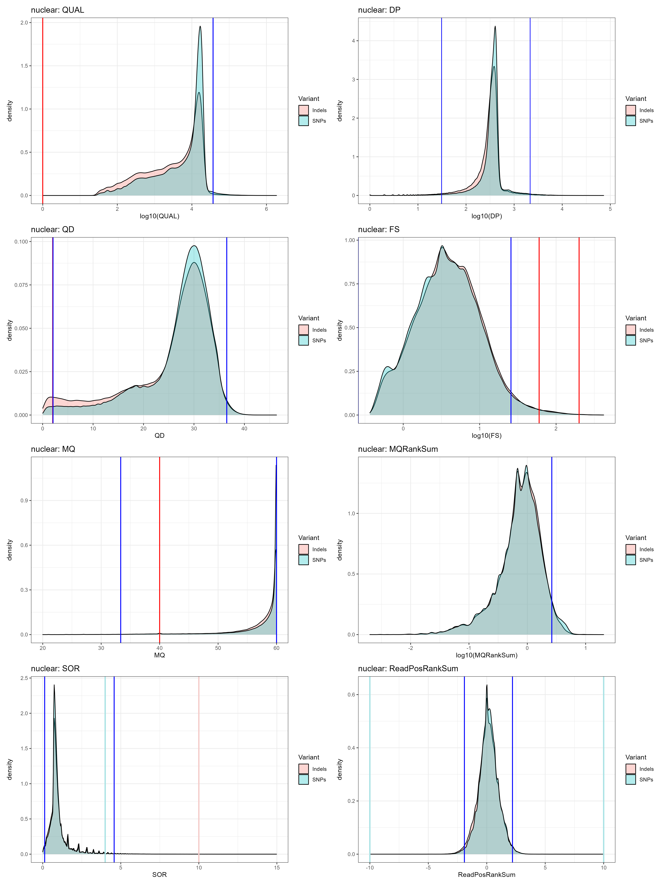
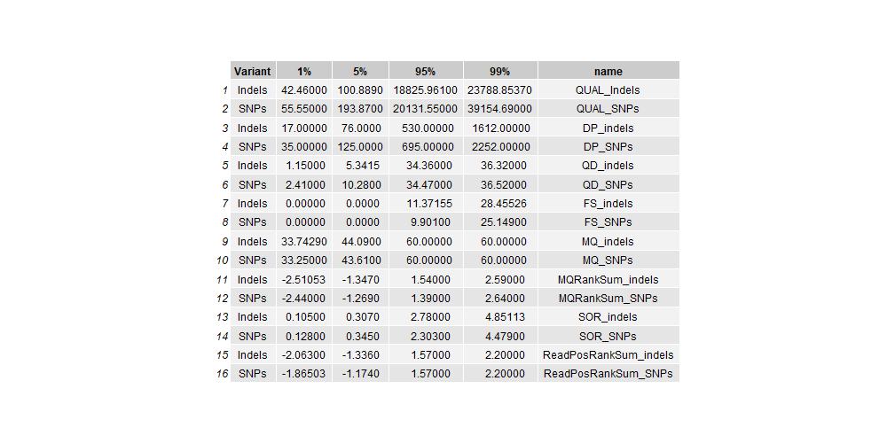

# Genome wide association study 

Author: Max Bär, max.baer[at]swisstph.ch

## Contents:

This section presents the code used for the genome wide association study of drug sensitive and non-sensitive *T. incognita* populations.
 It is presented by the individual nextflow processes which are combined in a final workflow or individual sections for further processing outside
of Nextflow. The scripts were run on the SciCORE computing cluster at the University of Basel with most modules pre-installed.

Table of contents

1. [Variant calling pipeline](#variants)
   1. [Nextflow settings](#settings)
   2. [Indexing assembled reference - process index](#index)
   3. [Aligning to reference genome - process alignment](#align)
   4. [Sorting and filtering bam file - process sorting](#sort)
   5. [QC flagstat, Kraken - process flagstat](#flagstat)
   6. [Mark duplicates - process mark_duplicates_spark](#duplicates)
   7. [Classify gender using coverage - process classify_gender](#gender)
   8. [Initial basecalling for BQSR - process initial_basecalling_BQSR](#initial_BQSR)
   9. [Initial hard filtering for BQSR - process initial_SNP_BQSR](#initial)
   10. [BQSR - process BQSR](#BQSR)
   11. [GVCF generation and merging - process GVCF](#GVCF)
   12. [Genotyping and filtering](#geno)
2. [Nextflow workflow](#NF1)
3. [GWAS in PLINK](#plink)
___
## Variant calling pipeline 
GATK was used to call variants.

### Nextflow environment variables 
DSL 2 option was used with nextflow and directories of genomes and databases used were defined outside of processes.

      nextflow.enable.dsl=2
      params.reads = "/*/GROUP/20230601_Raw_sequencing_Trichuris_whole_genome/2023*/GFB-*TRI*_R{1,2}_001.fastq.gz"
      params.outdir = "/*/Trichuris_Hominibus_CI/Nextflow/"
      params.reference = "/*/analysis_pipeline/Reference/Trichuris_cote_divoire_freeze.fasta"
      params.reference_path = "/*/analysis_pipeline/Reference/Trichuris_cote_divoire_freeze"
      params.path_kraken2_db = "/*/data/managed/.store/kraken_191029/"
      params.flagstat_output = "/*/analysis_pipeline/flagstat/"

### Indexing assembled reference - process index 
BWA, version 0.7.17, and SAMtools, version 1.14, was used to index the assembled reference genome.
      
      process index {
          
          input:
          path(reference)
      
          output:
          val(reference.baseName)
      
          script:
          """
          ml load BWA/0.7.17-GCC-10.3.0
          ml load SAMtools/1.14-GCC-10.3.0
          bwa index ${reference};
          
          samtools faidx ${reference};
          samtools dict ${reference} > ${params.reference_path}.dict
          """
      }

### Aligning to reference genome - process alignment 
BWA, version 0.7.17, and SAMtools, version 1.14, was used to align trimmed illumina reads to the assembled reference genome.

      process alignment {
          maxForks 60
      
          input:
          val(reference)
          tuple val(pair_id), path(reads)
          
          output:
          tuple val(pair_id), path("${pair_id}.bam")
          
          script:
          readGroup = "@RG\\tID:${pair_id}\\tLB:${pair_id}\\tPL:ILLUMINA\\tPM:NOVASEQ\\tSM:${pair_id}"
          """
          ml load BWA/0.7.17-GCC-10.3.0
          ml load SAMtools/1.14-GCC-10.3.0
          bwa mem \
          -t 4 $params.reference \
          -R \"${readGroup}\" \
          ${reads[0]} \
          ${reads[1]} | samtools view --threads 4 -b - \
          > ${pair_id}.bam
          """
      }

### Sorting and filtering bam file - process sorting 
Bam file was sorted using SAMtools, version 1.14.

      process sorting {
          maxForks 20
      
          input:
          tuple val(pair_id), path(reads)
      
          output:
          tuple val(pair_id), path("${pair_id}_filtered.bam")
      
          script:
          """
          ml load SAMtools/1.14-GCC-10.3.0
          samtools sort -o ${pair_id}_sorted.bam $reads;
          samtools view -F 4 -b -o ${pair_id}_filtered.bam ${pair_id}_sorted.bam;
          samtools index ${pair_id}_filtered.bam ${pair_id}_filtered.bam.bai
          """
      }

### QC flagstat, Kraken - process flagstat 
SAMtools version 1.14, MultiQC version 1.11, and Kraken2 version 2.1.1 was used to generate QC files. QC files are located in
the QC files folder.

      process flagstat {
          maxForks 20
          
          input:
          tuple val(pair_id), path(reads)
      
          output: 
          file("${pair_id}.flagstat")
      
          script:
          """
          ml load SAMtools/1.14-GCC-10.3.0
          samtools flagstat ${reads} > ${pair_id}.flagstat
          """
      }
      
      process multiqc_flagstat {
          publishDir "$params.flagstat_outputrun2", mode: 'copy'
      
          input:
          file(flagstat)
      
          output:
          file "multiqc_report_flagstat.html"
          
          script:
          """
          ml load MultiQC/1.11-foss-2018b-Python-3.6.6
          multiqc .;
          mv multiqc_report.html multiqc_report_flagstat.html
          """
      }
      
      process kraken2_impurities {
          maxForks 2
          
          input:
          tuple val(pair_id), path(reads)
          
          output:
          file("${pair_id}_kraken2report")
          
          script:
          """
          ml load Kraken2/2.1.1-foss-2018b-Perl-5.28.0
          kraken2 \
          --db $params.path_kraken2_db \
          --report ${pair_id}_kraken2report \
          --paired ${reads[0]} ${reads[1]}
          """
      }
      
      process multiqc_kraken2 {
          publishDir "$params.flagstat_output*", mode: 'copy'
      
          input:
          file(kraken2)
      
          output:
          file "multiqc_report_kraken2.html"
          
          script:
          """
          ml load MultiQC/1.11-foss-2018b-Python-3.6.6
          multiqc .;
          mv multiqc_report.html multiqc_report_kraken2.html
          """
      }

### Mark duplicates - process mark_duplicates_spark 
Duplicated reads are marked for basecalling.

      process mark_duplicates_spark {
          maxForks 5
          
          input:
          tuple val(pair_id), path(reads)
      
          output:
          tuple val(pair_id), path("${pair_id}_sorted_dedup.bam")
          
          script:
          """
          ml purge
          ml load Java/8u212b03
          ml load GATK/4.2.6.1-foss-2018b-Java-1.8
          gatk MarkDuplicatesSpark \
          -I ${reads} \
          -M ${pair_id}_dedup_metrics.txt \
          -O ${pair_id}_sorted_dedup.bam 
          """
      }

### Classify gender using coverage - process classify_gender 
Gender was classified using the coverage ratio of the largest X-chromosome scaffold. To the largest Scaffold on Chromosome 2.
Gender data is provided in the QC folder.

      process classify_gender {
          input:
          tuple val(pair_id), path(bam_file)
      
          output:
          path("${pair_id}.txt")
      
          script:
          """
          ml load SAMtools/1.16.1-GCC-10.3.0
          samtools index ${bam_file};
          cov_1="\$(samtools coverage -r TTRE_chr1_scaffold1 ${bam_file} | awk 'NR==2 {print \$7}')";
          cov_2="\$(samtools coverage -r TTRE_chr2_scaffold39 ${bam_file} | awk 'NR==2 {print \$7}')";
          ratio=\$(echo "\$cov_1 / \$cov_2" | bc -l)
          echo "\$cov_1\n\$cov_2\n\$ratio" >> ${pair_id}.txt
          """
      
      }
      
      process merge_gender_data {
          input:
          path(gender_files)
      
          output:
          path("merged_coverage.txt")
      
          script:
          """
          ml load Python/3.9.5-GCCcore-10.3.0
          python /scicore/home/schpie00/baer0006/Trichuris_Trichiura_CI/analysis_pipeline/merge_coverage.py
          """
      
      }

### Initial basecalling for BQSR - process initial_basecalling_BQSR 
Basecalling was done in a first round to obtain a subset of very likely SNP's for base quality score recalibration.
Plots were generated for QUAL, DP, QD, FS, MQ, MQRankSum, SQR, ReadPosRankSum. This code is largely adapted from the 
Doyle et al. paper on ancient and modern Trichuris, wherefrom also the heterozygosity values were adapted. Jellyfish
confirmed the same values for *Trichuris hominibus*.

      process initial_basecalling_BQSR {
          maxForks 56
          
          input:
          tuple val(pair_id), path(reads)
      
          output:
          tuple val(pair_id), path("${pair_id}_first_raw_variants.vcf")
          
          script:
          """
          ml load  GATK/4.2.4.1-GCCcore-10.3.0-Java-11 
          gatk HaplotypeCaller \
          -R ${params.reference} \
          -I ${reads} \
          --heterozygosity 0.015 \
              --indel-heterozygosity 0.01 \
          -O ${pair_id}_first_raw_variants.vcf
          """
      }

### Initial hard filtering for BQSR - process initial_SNP_BQSR 
An initial hard filtering was done based on the observed values for QUAL, DP, QD, FS, MQ, MQRankSum, SQR, ReadPosRankSum.

      process initial_SNP_BQSR {
          maxForks 56
          
          input:
          tuple val(pair_id), path(reads)
      
          output:
          tuple val(pair_id), path("${pair_id}_SNP_FOR_BQSR.vcf"), path("${pair_id}_SNP_FOR_BQSR.vcf.idx")
      
          script:
          """
          ml load  GATK/4.2.4.1-GCCcore-10.3.0-Java-11
          
          gatk SelectVariants \
          -R ${params.reference} \
          -V ${reads} \
          --select-type-to-include SNP \
          -O ${pair_id}_first_raw_variants_SNP.vcf;
      
          gatk VariantFiltration \
          -R ${params.reference} \
          -V ${pair_id}_first_raw_variants_SNP.vcf \
          --filter-expression ' QUAL < 194 || QD < 10.3 || MQ < 43.61 || FS > 9.9 || SOR > 2.30 || MQRankSum < -1.269 || ReadPosRankSum < -1.174 ' \
          --filter-name "SNP_5_filtered" \
          -O ${pair_id}_filtered_first_raw_variants_SNP.vcf;
      
          gatk SelectVariants \
          --exclude-filtered \
          -V ${pair_id}_filtered_first_raw_variants_SNP.vcf \
          -O ${pair_id}_SNP_FOR_BQSR.vcf
          """
      }
      
      process initial_INDEL_BQSR {
          maxForks 56
          
          input:
          tuple val(pair_id), path(reads)
      
          output:
          tuple val(pair_id), path("${pair_id}_INDEL_FOR_BQSR.vcf"), path("${pair_id}_INDEL_FOR_BQSR.vcf.idx")
      
          script:
          """
          ml load  GATK/4.2.4.1-GCCcore-10.3.0-Java-11
          gatk SelectVariants \
          -R ${params.reference} \
          -V ${reads} \
          --select-type-to-include INDEL \
          -O ${pair_id}_first_raw_variants_INDEL.vcf;
      
          gatk VariantFiltration \
          -R ${params.reference} \
          -V ${pair_id}_first_raw_variants_INDEL.vcf \
          --filter-expression ' QUAL < 101 || QD < 5.3 || FS > 11.4 || ReadPosRankSum < -1.336 ' \
          --filter-name "INDEL_5_filtered" \
          -O ${pair_id}_filtered_first_raw_variants_INDEL.vcf;
          
          gatk SelectVariants \
          --exclude-filtered \
          -V ${pair_id}_filtered_first_raw_variants_INDEL.vcf \
          -O ${pair_id}_INDEL_FOR_BQSR.vcf
          """
      }

### BQSR - process BQSR 
Base quality score recalibration

   process BQSR {
       maxForks 56
   
       input:
       tuple val(pair_id), path(SNPs), path(SNPindex), path(INDELs), path(INDELindex), path(BAM)
   
       output:
       tuple val(pair_id), path("${pair_id}_BQSR_recal.bam"), path("${pair_id}_BQSR_data_recalibration_plots.pdf"), path("${pair_id}_BQSR_data.table"), path("${pair_id}_BQSR_data_post.table")
   
       script:
       """
       ml load  GATK/4.2.4.1-GCCcore-10.3.0-Java-11
       ml load  R/4.2.2-foss-2021a
       
       gatk BaseRecalibrator \
       -R ${params.reference} \
       -I ${BAM} \
       --known-sites ${SNPs} \
       --known-sites ${INDELs} \
       -O ${pair_id}_BQSR_data.table;
   
       gatk ApplyBQSR \
       -R ${params.reference} \
       -I ${BAM} \
       -bqsr ${pair_id}_BQSR_data.table\
       -O ${pair_id}_BQSR_recal.bam;
   
       gatk BaseRecalibrator \
       -R ${params.reference} \
       -I ${pair_id}_BQSR_recal.bam \
       --known-sites ${SNPs} \
       --known-sites ${INDELs} \
       -O ${pair_id}_BQSR_data_post.table;
   
       gatk AnalyzeCovariates \
       -before ${pair_id}_BQSR_data.table \
       -after ${pair_id}_BQSR_data_post.table \
       -plots ${pair_id}_BQSR_data_recalibration_plots.pdf
       """
   }

### GVCF generation and merging - process GVCF 
GVCF generation and merging 

      process GVCF {
          maxForks 56
      
          input:
          tuple val(pair_id), path(recal_BAMs), path(recalplot), path(datatable_pre), path(datatable_post)
      
          output:
          tuple path("${pair_id}.g.vcf.gz"), path("${pair_id}.g.vcf.gz.tbi")
      
          script:
          """
          ml load  GATK/4.2.4.1-GCCcore-10.3.0-Java-11
          
          gatk HaplotypeCaller \
          -R ${params.reference} \
          -I ${recal_BAMs} \
          --heterozygosity 0.015 \
          --indel-heterozygosity 0.01 \
          -O ${pair_id}.g.vcf.gz \
          -A DepthPerAlleleBySample \
          -A Coverage \
          -A ExcessHet \
          -A FisherStrand \
          -A MappingQualityRankSumTest \
          -A StrandOddsRatio \
          -A RMSMappingQuality \
          -A ReadPosRankSumTest \
          -A DepthPerSampleHC \
          -A QualByDepth \
          -ERC GVCF
          """
      }
      
      process merge_GVCF {
          input:
          path(VCFs)
          path(VCF_indices)
      
          output:
          tuple path("cohort.g.vcf.gz"), path("cohort.g.vcf.gz.tbi")
      
          script:
          
          def input_list = VCFs.collect{"--variant $it"}.join(' ')
          """
          ml load  GATK/4.2.4.1-GCCcore-10.3.0-Java-11
      
          gatk CombineGVCFs \
          -R ${params.reference} \
          $input_list \
          -O cohort.g.vcf.gz
          """
      }

### Genotyping and filtering 
Genotyping and filtering

      process genotyping {
          input:
          tuple path(gVCF_cohort), path(index)
      
          output:
          tuple path("Trichuris_CI_cohort.vcf.gz"), path("Trichuris_CI_cohort.vcf.gz.tbi")
      
          script:
          """
          ml load  GATK/4.2.4.1-GCCcore-10.3.0-Java-11
      
          gatk GenotypeGVCFs \
          -R ${params.reference} \
          -V ${gVCF_cohort} \
          -A DepthPerAlleleBySample \
          -A Coverage \
          -A ExcessHet \
          -A FisherStrand \
          -A MappingQualityRankSumTest \
          -A StrandOddsRatio \
          -A RMSMappingQuality \
          -A ReadPosRankSumTest \
          -A DepthPerSampleHC \
          -A QualByDepth \
          --heterozygosity 0.015 \
              --indel-heterozygosity 0.01 \
          -O Trichuris_CI_cohort.vcf.gz
          """
      }
      
      process select_geno_SNP_INDEL {
          input:
          tuple path(VCF_cohort), path(index)
          
          output:
          tuple path("Trichuris_CI_cohort.genoSNP.vcf.gz"), path("Trichuris_CI_cohort.genoSNP.vcf.gz.tbi"), path("Trichuris_CI_cohort.genoINDEL.vcf.gz"), path("Trichuris_CI_cohort.genoINDEL.vcf.gz.tbi")
          
          script:
          """
          ml load  GATK/4.2.4.1-GCCcore-10.3.0-Java-11
          gatk SelectVariants \
          -R ${params.reference} \
          --variant ${VCF_cohort} \
          --select-type-to-include SNP \
          -O Trichuris_CI_cohort.genoSNP.vcf.gz
          
          gatk SelectVariants \
          -R ${params.reference} \
          --variant ${VCF_cohort} \
          --select-type-to-include INDEL \
          -O Trichuris_CI_cohort.genoINDEL.vcf.gz
          """
      }
      
      process make_table_geno_SNP_INDEL {
          input:
          tuple path(genoSNP_vcf), path(genoSNP_vcf_index), path(genoINDEL_vcf), path(genoINDEL_vcf_index)
      
          output:
          tuple path("geno_snp_vcf.table"), path("geno_indel_vcf.table")
      
          script:
          """
          ml load  GATK/4.2.4.1-GCCcore-10.3.0-Java-11
          gatk VariantsToTable \
          -R ${params.reference} \
          --variant ${genoSNP_vcf} \
          --fields CHROM --fields POS --fields QUAL --fields QD --fields DP --fields MQ --fields MQRankSum --fields FS --fields ReadPosRankSum --fields SOR \
          -O geno_snp_vcf.table
      
      
          gatk VariantsToTable \
          -R ${params.reference} \
          --variant ${genoINDEL_vcf} \
          --fields CHROM --fields POS --fields QUAL --fields QD --fields DP --fields MQ --fields MQRankSum --fields FS --fields ReadPosRankSum --fields SOR \
          -O geno_indel_vcf.table
          """
      }
      
      process filter_geno_SNP_INDEL {
          input:
          tuple path(genoSNP_vcf), path(genoSNP_vcf_index), path(genoINDEL_vcf), path(genoINDEL_vcf_index)
      
          output:
          path ("Trichuris_CI_cohort.geno.final.recode.vcf")
      
          script:
          """
          ml load  GATK/4.2.4.1-GCCcore-10.3.0-Java-11
          ml load VCFtools/0.1.16-GCC-10.3.0
      
          gatk VariantFiltration \
          -R ${params.reference} \
          --variant ${genoSNP_vcf} \
          --filter-expression ' QUAL < 35 || QD < 1.3 || MQ < 28.76 || FS > 50.5 || SOR > 2.30 || MQRankSum < -4.261 || ReadPosRankSum < -1.421 ' \
          --filter-name "SNP_filtered" \
          -O Trichuris_CI_cohort.genoSNP.filtered.vcf
          
          gatk VariantFiltration \
          -R ${params.reference} \
          --variant ${genoINDEL_vcf} \
          --filter-expression ' QUAL < 32 || QD < 0.5 || FS > 30.1 || ReadPosRankSum < -1.836 ' \
          --filter-name "INDEL_filtered" \
          -O Trichuris_CI_cohort.genoINDEL.filtered.vcf;
          
          gatk MergeVcfs \
          -I Trichuris_CI_cohort.genoSNP.filtered.vcf \
          -I Trichuris_CI_cohort.genoINDEL.filtered.vcf \
          -O Trichuris_CI_cohort.genoMERGED.filtered.vcf;
          
          gatk VariantFiltration \
          -R ${params.reference} \
          --variant Trichuris_CI_cohort.genoMERGED.filtered.vcf \
          --genotype-filter-expression ' DP < 3 '  \
          --genotype-filter-name "DP_genotype_3" \
          --output Trichuris_CI_cohort.geno.genotype_filtered.vcf;
          
          gatk SelectVariants \
          -R ${params.reference} \
          --variant Trichuris_CI_cohort.geno.genotype_filtered.vcf \
          --set-filtered-gt-to-nocall \
          --output Trichuris_CI_cohort.geno.genotype_filtered_nocall.vcf;
          
          vcftools \
          --vcf Trichuris_CI_cohort.geno.genotype_filtered_nocall.vcf \
          --remove-filtered-geno-all \
          --remove-filtered-all \
          --min-alleles 2 \
          --max-alleles 2 \
          --maf 0.02 \
          --recode \
          --recode-INFO-all \
          --out Trichuris_CI_cohort.geno.final
          
          vcftools \
          --vcf Trichuris_CI_cohort.geno.final.recode.vcf \
          --remove-indels
          """
      }

## Nextflow workflow 
All processes were stitched together in one workflow

      workflow {
          read_pairs_ch = channel.fromFilePairs(params.reads, checkIfExists: true)
      
          index(params.reference)
          index_ch = index.out
      
          alignment(index_ch, read_pairs_ch)
          aligned_ch = alignment.out
      
          flagstat(aligned_ch)
          flagstat_ch = flagstat.out
      
          multiqc_flagstat(flagstat_ch.collect())
      
          sorting(aligned_ch)
          sorted_filtered_ch = sorting.out
          
          mark_duplicates_spark(sorted_filtered_ch)
          deduplicated_reads_ch = mark_duplicates_spark.out
      
          classify_gender(sorted_filtered_ch)
          classify_gender_ch = classify_gender.out
          
          merge_gender_data(classify_gender_ch.collect())
          merge_gender_data_ch = merge_gender_data.out
          
          initial_basecalling_BQSR(deduplicated_reads_ch)
          first_raw_variants_ch = initial_basecalling_BQSR.out
          
          initial_SNP_BQSR(first_raw_variants_ch)
          SNPs_for_BQSR_ch = initial_SNP_BQSR.out
      
          initial_INDEL_BQSR(first_raw_variants_ch)
          INDELs_for_BQSR_ch = initial_INDEL_BQSR.out
      
          INDEL_SNP_BQSR_ch = SNPs_for_BQSR_ch.join(INDELs_for_BQSR_ch).join(deduplicated_reads_ch)
      
          BQSR(INDEL_SNP_BQSR_ch)
          BQSR_bam_ch = BQSR.out
      
          GVCF(BQSR_bam_ch)
          GVCF_ch = GVCF.out
          
          merge_GVCF(GVCF_ch.map { it[0] }.collect(), GVCF_ch.map { it[1] }.collect())
          merged_GVCF_ch = merge_GVCF.out
      
          genotyping(merged_GVCF_ch)
          genotyped_merged_vcf_ch = genotyping.out
      
          select_geno_SNP_INDEL(genotyped_merged_vcf_ch)
          geno_SNP_INDEL_ch = select_geno_SNP_INDEL.out
          
           make_table_geno_SNP_INDEL(geno_SNP_INDEL_ch)
           make_table_geno_SNP_INDEL_ch = make_table_geno_SNP_INDEL.out
      
           filter_geno_SNP_INDEL(geno_SNP_INDEL_ch)
           filter_geno_SNP_INDEL_ch = filter_geno_SNP_INDEL.out
      }
      

## GWAS in PLINK 

Plink (version 1.9) was used to conduct the genome wide association study. A principal component analysis
 (PCA) was conducted to account for population stratification. The PCA together with 
information on worm-sex was used in the linear regression option in PLINK. The R package 
 qqman was used to visualize the results.

      plink --vcf /scicore/home/schpie00/baer0006/Trichuris_Trichiura_CI/VCF_Annotation_pipeline/run1/Trichuris_CI_cohort_geno_final_recode_test.ann.vcf --make-bed --out /scicore/home/schpie00/baer0006/Trichuris_Trichiura_CI/analysis_pipeline/results_vcf/playground/Third_genome_snpeff/runsnpeff_new_genome_plink --double-id --allow-extra-chr;
      
      
      plink   --allow-extra-chr \
        --allow-no-sex \
        --bfile /scicore/home/schpie00/baer0006/Trichuris_Trichiura_CI/analysis_pipeline/results_vcf/playground/Third_genome_snpeff/runsnpeff_new_genome_plink \
        --make-bed \
        --out /scicore/home/schpie00/baer0006/Trichuris_Trichiura_CI/analysis_pipeline/results_vcf/playground/Third_genome_snpeff/run5eff_added_pheno \
        --pheno /scicore/home/schpie00/baer0006/Trichuris_Trichiura_CI/analysis_pipeline/results_vcf/playground/First_genome/Main_Phenotype_File.txt ;
        
      plink   --allow-extra-chr \
        --bfile /scicore/home/schpie00/baer0006/Trichuris_Trichiura_CI/analysis_pipeline/results_vcf/playground/Third_genome_snpeff/run5eff_added_pheno \
        --make-bed \
        --out /scicore/home/schpie00/baer0006/Trichuris_Trichiura_CI/analysis_pipeline/results_vcf/playground/Third_genome_snpeff/run5eff_added_sex \
        --update-sex /scicore/home/schpie00/baer0006/Trichuris_Trichiura_CI/analysis_pipeline/results_vcf/playground/First_genome/Main_Phenotype_File_sex.txt ;
      
      plink   --allow-extra-chr \
        --assoc \
        --bfile /scicore/home/schpie00/baer0006/Trichuris_Trichiura_CI/analysis_pipeline/results_vcf/playground/Third_genome_snpeff/run5eff_added_sex \
        --out /scicore/home/schpie00/baer0006/Trichuris_Trichiura_CI/analysis_pipeline/results_vcf/playground/Third_genome_snpeff/run5eff_assoc ;
        
      
      plink   --allow-extra-chr \
        --bfile /scicore/home/schpie00/baer0006/Trichuris_Trichiura_CI/analysis_pipeline/results_vcf/playground/Third_genome_snpeff/run5eff_added_sex \
        --make-bed \
        --out /scicore/home/schpie00/baer0006/Trichuris_Trichiura_CI/analysis_pipeline/results_vcf/playground/Third_genome_snpeff/run5eff_added_sex_filt \
        --geno 0.05 --mind --maf 0.05 --hwe 0.001 ;
      
      plink   --allow-extra-chr \
        --bfile /scicore/home/schpie00/baer0006/Trichuris_Trichiura_CI/analysis_pipeline/results_vcf/playground/Third_genome_snpeff/run5eff_added_sex_filt \
        --pca \
        --allow-no-sex \
        --mind \
        --out /scicore/home/schpie00/baer0006/Trichuris_Trichiura_CI/analysis_pipeline/results_vcf/playground/Third_genome_snpeff/run5eff_added_sex_filt_pca ;
      
      
      plink --allow-extra-chr \
        --bfile /scicore/home/schpie00/baer0006/Trichuris_Trichiura_CI/analysis_pipeline/results_vcf/playground/Third_genome_snpeff/run5eff_added_sex_filt \
        --covar /scicore/home/schpie00/baer0006/Trichuris_Trichiura_CI/analysis_pipeline/results_vcf/playground/Third_genome_snpeff/run5eff_added_sex_filt_pca.eigenvec \
        --covar-number 1 \
        --logistic \
        --out /scicore/home/schpie00/baer0006/Trichuris_Trichiura_CI/analysis_pipeline/results_vcf/playground/Third_genome_snpeff/run5eff_assoc_with_pca \
        --allow-no-sex ;

R-Script using qq-man package. Briefly, gender was taken into account and population stratification. A linear 
regression model was chosen, although we also ran a logistical regression model.

Running the GWAS with the gender information served as a positive control of the pipeline.

      library(qqman)
      library(tidyverse)
      
      par(mfrow = c(3, 1), mar = c(2, 6, 2, 1))
      
      
      
      
      gwas_results_female_male <- read.table("2runsnpeff_missense_assoc.assoc", header = TRUE, stringsAsFactors = FALSE)
      threshold=1e-5
      
      #SNP's to filter out
      SNP_female_male <- gwas_results_female_male$SNP[gwas_results_female_male$P < threshold]
      
      #Load df and filter out SNP's
      gwas_results <- read.table("runsnpeff_missense_assoc_linear_with_pca.assoc", header = TRUE, stringsAsFactors = FALSE)
      
      gwas_results$CHR <- as.integer(sub(".*scaffold([0-9]+)", "\\1", gwas_results$CHR))
      gwas_results <- gwas_results[ , c("SNP", "CHR", "BP", "P")]
      gwas_results <- gwas_results %>%
        filter(!is.na(BP) & is.finite(BP) & !is.na(P) & is.finite(P))
      
      gwas_results_filtered <- gwas_results[!gwas_results$SNP %in% SNP_female_male, ]
      
      
      #load duplications
      gene_regions <- as.data.frame(read.csv("combined_fasta_results.csv")) 
      gene_regions$Scaffold <- as.numeric(gene_regions$Scaffold)
      
      
      merged_data <- gwas_results_filtered %>%
        # Expand GWAS data by all gene regions (cartesian product)
        expand_grid(gene_regions) %>%
        # Filter to retain only matching scaffolds where BP is within Start and Stop
        filter(CHR == Scaffold, BP >= Start, BP <= Stop) %>%
        # If no genes are matched, keep original SNP; otherwise, use Gene name
        mutate(SNP = coalesce(Gene, SNP)) %>%
        # Drop unnecessary columns
        select(SNP, CHR = Scaffold, BP, P)
      
      final_data <- gwas_results_filtered %>%
        # Anti-join to find all SNPs not in any gene region
        anti_join(merged_data, by = c("CHR", "BP", "P")) %>%
        # Combine with merged data which includes SNPs in gene regions
        bind_rows(merged_data) %>%
        # Arrange by chromosome and base pair position
        arrange(CHR, BP)
      
      gwas_results1 <- final_data
      gwas_results[gwas_results$BP == 26946418, ]
      
      gwas_results1$Gene <- sub(".*_g(\\d+)$", "g\\1", gwas_results1$SNP)
      threshold=1e-4
      highlight <- gwas_results1$SNP[gwas_results1$P < threshold]
      highlight <- sub(".*_g(\\d+)$", "g\\1", highlight)
      
      filtered_gwas_results <- gwas_results1[gwas_results1$Gene %in% highlight, ]
      filtered_gwas_results$SNP
      highlight <- filtered_gwas_results$SNP
      manhattan(gwas_results1,
                chr = "CHR",             
                bp = "BP",               
                p = "P",                 
                snp = "SNP",             
                xlab = "",
                ylim = c(0, 7), 
                main = "Suggestive associations (top), highly duplicated genes (middle), genes associated with ivermectin resistance (bottom)",
                highlight = highlight,
                suggestiveline = -log10(1e-4), 
                genomewideline = -log10(1e-7),
                cex.axis = 2,
                cex.lab = 2,
                cex.main = 2
                )
      
      abline(v = 21250000, col = "grey15", lwd = 2, lty = 2)
      abline(v = 53380673, col = "grey15", lwd = 2, lty = 2)
      abline(v = 75600000, col = "grey15", lwd = 2, lty = 2)
      
      
      
      
      gwas_results_female_male <- read.table("2runsnpeff_missense_assoc.assoc", header = TRUE, stringsAsFactors = FALSE)
      threshold=1e-5
      
      #SNP's to filter out
      SNP_female_male <- gwas_results_female_male$SNP[gwas_results_female_male$P < threshold]
      
      #Load df and filter out SNP's
      gwas_results <- read.table("runsnpeff_missense_assoc_linear_with_pca.assoc", header = TRUE, stringsAsFactors = FALSE)
      
      gwas_results$CHR <- as.integer(sub(".*scaffold([0-9]+)", "\\1", gwas_results$CHR))
      gwas_results <- gwas_results[ , c("SNP", "CHR", "BP", "P")]
      gwas_results <- gwas_results %>%
        filter(!is.na(BP) & is.finite(BP) & !is.na(P) & is.finite(P))
      
      #now filter the gwas_results df to drop all sex related SNP's
      gwas_results_filtered <- gwas_results[!gwas_results$SNP %in% SNP_female_male, ]
      
      
      #load duplications
      gene_regions <- as.data.frame(read.csv("combined_fasta_results.csv")) 
      gene_regions$Scaffold <- as.numeric(gene_regions$Scaffold)
      
      
      merged_data <- gwas_results_filtered %>%
        # Expand GWAS data by all gene regions (cartesian product)
        expand_grid(gene_regions) %>%
        # Filter to retain only matching scaffolds where BP is within Start and Stop
        filter(CHR == Scaffold, BP >= Start, BP <= Stop) %>%
        # If no genes are matched, keep original SNP; otherwise, use Gene name
        mutate(SNP = coalesce(Gene, SNP)) %>%
        # Drop unnecessary columns
        select(SNP, CHR = Scaffold, BP, P)
      
      final_data <- gwas_results_filtered %>%
        # Anti-join to find all SNPs not in any gene region
        anti_join(merged_data, by = c("CHR", "BP", "P")) %>%
        # Combine with merged data which includes SNPs in gene regions
        bind_rows(merged_data) %>%
        # Arrange by chromosome and base pair position
        arrange(CHR, BP)
      
      gwas_results1 <- final_data
      
      gwas_results1$Gene <- sub(".*_g(\\d+)$", "g\\1", gwas_results1$SNP)
      threshold=1e-4
      
      highlight <- gwas_results1$SNP[gwas_results1$P < threshold]
      highlight <- sub(".*_g(\\d+)$", "g\\1", highlight)
      
      filtered_gwas_results <- gwas_results1[gwas_results1$Gene %in% highlight, ]
      filtered_gwas_results$SNP
      
      
      highlight2 <- c("b-tubulin_OG0000671", "Condensin_OG0000186","Kinesin_OG0000145", "Haspin_like_kinase_OG0000285",  "MAP65_ASE1_OG0000628", "TF_III_OG0000681")
      
      manhattan(gwas_results1,
                chr = "CHR",             
                bp = "BP",               
                p = "P",                 
                snp = "SNP",             
                ylim = c(0, 7), 
                highlight = highlight2,
                suggestiveline = -log10(1e-4),  
                genomewideline = -log10(1e-7),
                cex.axis = 2,
                cex.lab = 2
      )
      
      
      
      
      abline(v = 21250000, col = "grey15", lwd = 2, lty = 2)
      abline(v = 53380673, col = "grey15", lwd = 2, lty = 2)
      abline(v = 75600000, col = "grey15", lwd = 2, lty = 2)
      
      
      
      
      
      
      
      
      
      
      
      
      
      
      gwas_results_female_male <- read.table("2runsnpeff_missense_assoc.assoc", header = TRUE, stringsAsFactors = FALSE)
      threshold=1e-5
      
      #SNP's to filter out
      SNP_female_male <- gwas_results_female_male$SNP[gwas_results_female_male$P < threshold]
      
      #Load df and filter out SNP's
      gwas_results <- read.table("runsnpeff_missense_assoc_linear_with_pca.assoc", header = TRUE, stringsAsFactors = FALSE)
      
      gwas_results$CHR <- as.integer(sub(".*scaffold([0-9]+)", "\\1", gwas_results$CHR))
      gwas_results <- gwas_results[ , c("SNP", "CHR", "BP", "P")]
      gwas_results <- gwas_results %>%
        filter(!is.na(BP) & is.finite(BP) & !is.na(P) & is.finite(P))
      
      #now filter the gwas_results df to drop all sex related SNP's
      gwas_results_filtered <- gwas_results[!gwas_results$SNP %in% SNP_female_male, ]
      # Filter out rows where CHR is 3
      
      
      #load duplications
      gene_regions <- as.data.frame(read.csv("combined_fasta_results.csv")) 
      gene_regions$Scaffold <- as.numeric(gene_regions$Scaffold)
      
      
      merged_data <- gwas_results_filtered %>%
        # Expand GWAS data by all gene regions (cartesian product)
        expand_grid(gene_regions) %>%
        # Filter to retain only matching scaffolds where BP is within Start and Stop
        filter(CHR == Scaffold, BP >= Start, BP <= Stop) %>%
        # If no genes are matched, keep original SNP; otherwise, use Gene name
        mutate(SNP = coalesce(Gene, SNP)) %>%
        # Drop unnecessary columns
        select(SNP, CHR = Scaffold, BP, P)
      
      final_data <- gwas_results_filtered %>%
        # Anti-join to find all SNPs not in any gene region
        anti_join(merged_data, by = c("CHR", "BP", "P")) %>%
        # Combine with merged data which includes SNPs in gene regions
        bind_rows(merged_data) %>%
        # Arrange by chromosome and base pair position
        arrange(CHR, BP)
      
      gwas_results1 <- final_data
      gwas_results[gwas_results$BP == 26946418, ]
      
      
      gwas_results1$Gene <- sub(".*_g(\\d+)$", "g\\1", gwas_results1$SNP)
      threshold=1e-4
      
      genes_ivermectin_res <- c("g724", "g841", "g1463", "g12517")
      
      highlight3 <- genes_ivermectin_res
      head(gwas_results1)
      
      filtered_gwas_results <- gwas_results1[gwas_results1$Gene %in% highlight3, ]
      filtered_gwas_results$SNP
      highlight3 <- filtered_gwas_results$SNP
      
      manhattan(gwas_results1,
                chr = "CHR",             
                bp = "BP",               
                p = "P",                
                snp = "SNP",     
                xlab = "Scaffolds",
                ylim = c(0, 7), 
                highlight = highlight3,
                suggestiveline = -log10(1e-4), 
                genomewideline = -log10(1e-7),
                cex.axis = 2,
                cex.lab = 2
      )
      
      abline(v = 21250000, col = "grey15", lwd = 2, lty = 2)
      abline(v = 53380673, col = "grey15", lwd = 2, lty = 2)
      abline(v = 75600000, col = "grey15", lwd = 2, lty = 2)

